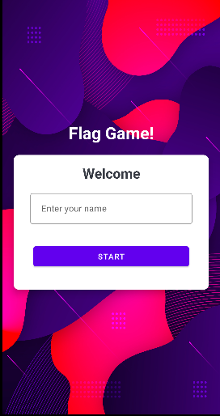
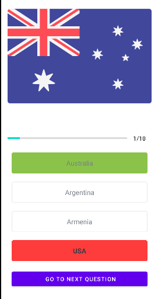

##  Quiz App-Kotlin (Navigation + Databinding Included)

This is a basic android development project that I made during my learning phase of android dev using kotlin.

This app has. 

1. Navigation Component
2. DataBinding
3. Fragments
5. ArrayList
6. Kotlin Object. 

### Title Fragement

### Game Fragment

### Score Fragment

